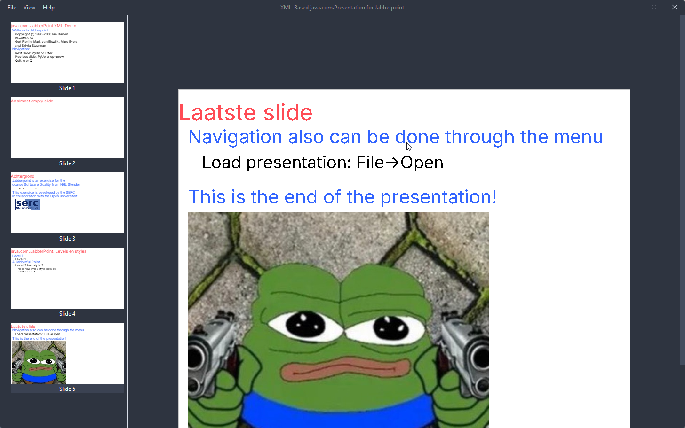
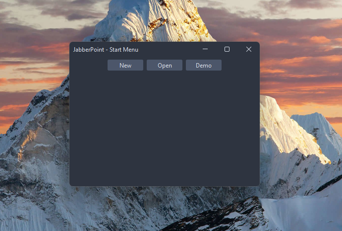
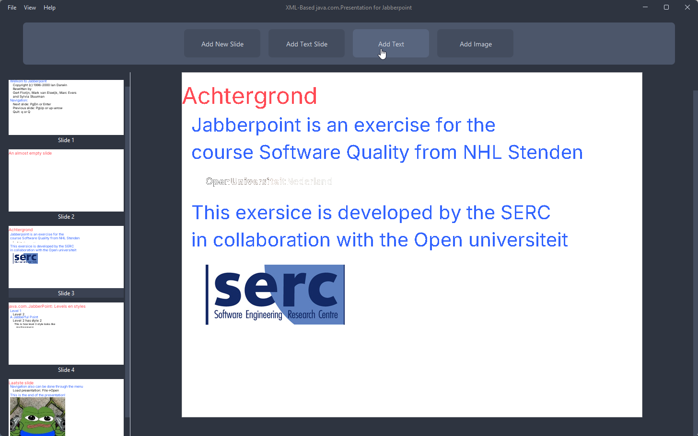

# Jabberpoint

# Design Patterns Presentation Application

## Introduction

Jabberpoint is a Java-based presentation application that allows users to create and edit slideshows. The application is
designed to demonstrate various design patterns in Java, including the Factory Method, Decorator, and State patterns.

###      



## Keyboard Shortcuts

- `E` – Toggle **Editing Mode**
- `F` – Toggle **Fullscreen Mode**
- `Arrow Up` – Go to **Previous Slide**
- `Arrow Down` – Create **Next Slide**
- `Q` – **Exit** the application

## How to Run **Tests**

Make sure you have **Maven** installed.

To run the **Tests**:

```bash
mvn test
```

---

## Implemented Design Patterns

- **Factory Method Pattern**
- **Decorator Pattern**
- **State Pattern**

---
---

## CI/CD Pipeline

- All tests are automatically run **on every pull request** targeting the `main` branch.
- **Direct pushes to the `main` branch are not allowed** – all changes must go through a pull request.
- A pull request will only be merged if:
  - All **GitHub Actions checks pass** (e.g., tests, build)
  - At least **one other user approves** the changes

This ensures code quality and collaboration before deploying any updates.

---

## Code Improvements

- Fixed several code bugs:
    - Reoccurring shortcut issues
    - Images not rendering in the application
    - Sidebar not showing
    - Broken open/save file functionality

---

## New Features Added

- Fullscreen mode
- Editing mode
- Normal mode
- Ability to:
    - Add slides
    - Add text to slides
    - Decorate slides (via decorator pattern)
- Start menu interface

---

## Images

### Start menu



### Viewing mode


### Editing mode



### Fullscreen mode


