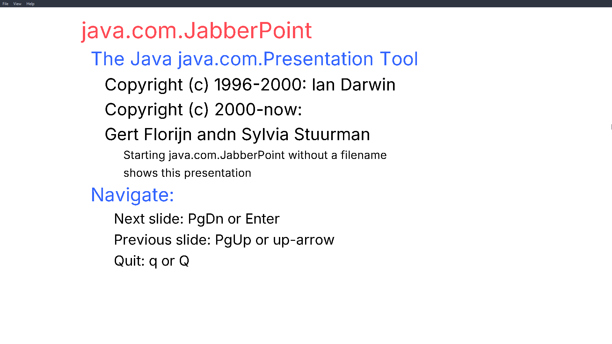

# Jabberpoint

# Resit changes 
## SlideItem Factory Refactor
### Changes

1. Deleted SlideItemFactory (static utility class).
2. Kept TextItemFactory and BitmapItemFactory for creating text and image items.
3. Simplified creating Bold or Italic items ( removed redundunt functions in Interface, instead added a single function to the TextItemFactory)
4. Implemented factory usage across the application ( before we still had new TextItem() code for some reason, but now everyting is implemented using factories)


### Usage

```java
TextItemFactory textFactory = new TextItemFactory();
SlideItem textItem = textFactory.createFormattedItem(1, "Hello", true, false);

BitmapItemFactory bitmapFactory = new BitmapItemFactory();
SlideItem imageItem = bitmapFactory.createItem(2, "image.png");
```

### Notes

- TextItemFactory handles optional bold/italic formatting.
- Use SlideItemDecoratorUtil to apply decorators dynamically.
- Each factory is responsible for its own item type only.


## DTAP

We tried to implement a **DTAP (Develop, Test, Acceptance, Production)** deployment pipeline managed via GitHub Actions.

### Now we have 4 branches:

#### `develop`
- Code is built and unit tests are executed.
- Trigger: `push` to `develop` branch.

#### `testing`
- Builds the code and runs integration tests.
- Trigger: `push` to `testing` branch.

#### `acceptance`
- Builds and runs acceptance (E2E) tests.
- Trigger: `push` to `acceptance` branch.

#### `main` ( production )
- Triggers deployment to production.
- Separately, a release workflow is triggered that:
  - Builds the `.jar` file.
  - Creates a GitHub Release with the JAR attached.
- Trigger: `push` to `main` branch.


Note: jars produced by automatic releases do not run, it was done as an example
### GitHub Actions Files

- `.github/workflows/dtap-pipeline.yml`: Handles the DTAP logic (build, test, acceptance, deployment steps).
- `.github/workflows/release.yml`: Handles building the JAR and publishing it as a GitHub Release.

## Decorator pattern 

- Removed instanceof from the decorator pattern 
- Fixed bug with bold and italic text always being applied

## Documentation 

- Add old documentation in the `docs/` folder

# Old description 

## Introduction

Jabberpoint is a Java-based presentation application that allows users to create and edit slideshows. The application is
designed to demonstrate various design patterns in Java, including the Factory Method, Decorator, and State patterns.

###      


## Keyboard Shortcuts

- `E` – Toggle **Editing Mode**
- `F` – Toggle **Fullscreen Mode**
- `Arrow Up` – Go to **Previous Slide**
- `Arrow Down` – Go to **Next Slide**
- `Q` – **Exit** the application 
## How to Run Project
```bash 
mvn compile
mvn exec:java
```  

## How to Run **Tests**

Make sure you have **Maven** installed. 

To run the **Tests**:

```bash
mvn test
```

---

## Implemented Design Patterns

- **Factory Method Pattern**
- **Decorator Pattern**
- **State Pattern**

---
---

## CI/CD Pipeline

- All tests are automatically run **on every pull request** targeting the `main` branch.
- **Direct pushes to the `main` branch are not allowed** – all changes must go through a pull request.
- A pull request will only be merged if:
  - All **GitHub Actions checks pass** (e.g., tests, build)
  - At least **one other user approves** the changes

This ensures code quality and collaboration before deploying any updates.

---

## Code Improvements

- Fixed several code bugs:
    - Reoccurring shortcut issues
    - Images not rendering in the application
    - Sidebar not showing
    - Broken open/save file functionality

---

## New Features Added

- Fullscreen mode
- Editing mode
- Normal mode
- Ability to:
    - Add slides
    - Add text to slides
    - Decorate slides (via decorator pattern)
- Start menu interface

---

## Images

### Start menu


### Viewing mode


### Editing mode


### Fullscreen mode


